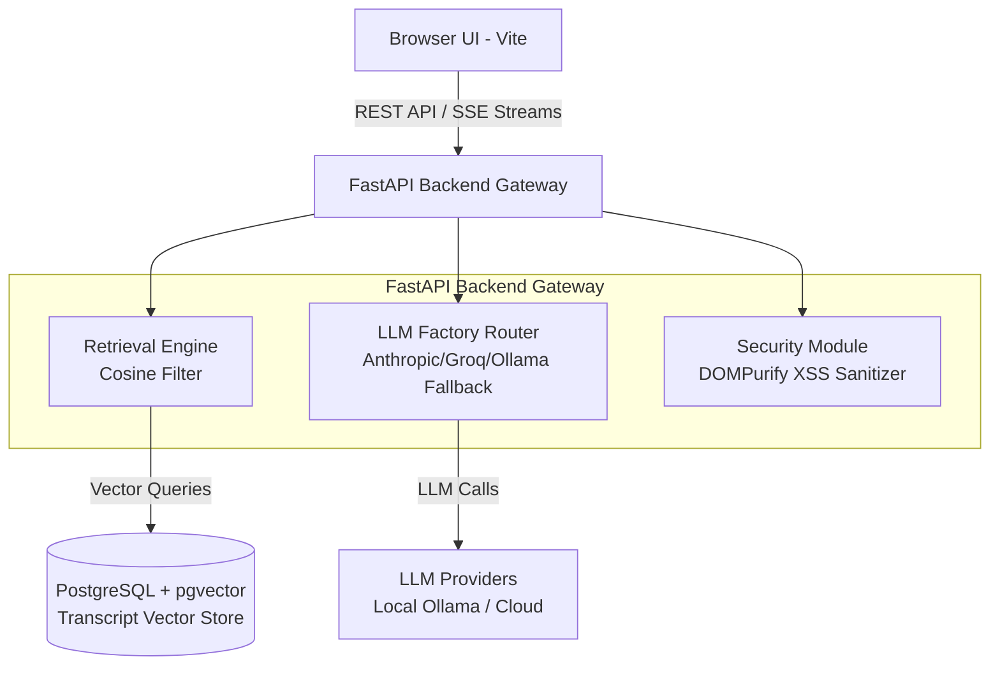

# System Architecture & Technical Specifications

## 1. System Topology Overview



## 2. Database Schema DDL (`schema.sql`)

```sql
CREATE EXTENSION IF NOT EXISTS vector;

CREATE TABLE transcript_chunks (
    id UUID PRIMARY KEY DEFAULT gen_random_uuid(),
    episode_title VARCHAR(500) NOT NULL,
    guest_name VARCHAR(255) NOT NULL,
    content TEXT NOT NULL,
    embedding vector(1536) NOT NULL,
    created_at TIMESTAMP WITH TIME ZONE DEFAULT CURRENT_TIMESTAMP
);

CREATE INDEX idx_transcript_chunks_embedding ON transcript_chunks USING ivfflat (embedding vector_cosine_ops) WITH (lists = 100);

CREATE TABLE sessions (
    id UUID PRIMARY KEY DEFAULT gen_random_uuid(),
    title VARCHAR(255) NOT NULL,
    provider_used VARCHAR(50) NOT NULL,
    created_at TIMESTAMP WITH TIME ZONE DEFAULT CURRENT_TIMESTAMP
);

CREATE TABLE messages (
    id UUID PRIMARY KEY DEFAULT gen_random_uuid(),
    session_id UUID REFERENCES sessions(id) ON DELETE CASCADE,
    sender VARCHAR(20) CHECK (sender IN ('user', 'assistant')),
    content TEXT NOT NULL,
    citations JSONB DEFAULT '[]'::jsonb,
    created_at TIMESTAMP WITH TIME ZONE DEFAULT CURRENT_TIMESTAMP
);

CREATE TABLE artifacts (
    id UUID PRIMARY KEY DEFAULT gen_random_uuid(),
    session_id UUID REFERENCES sessions(id) ON DELETE CASCADE,
    title VARCHAR(255) NOT NULL,
    artifact_type VARCHAR(50) NOT NULL,
    raw_content TEXT NOT NULL,
    sanitized_html TEXT NOT NULL,
    created_at TIMESTAMP WITH TIME ZONE DEFAULT CURRENT_TIMESTAMP
);
```

## 3. Ingestion & Retrieval Sequence Flow
- **Ingestion:** Transcripts $\rightarrow$ Chunked (500 words, 50 word overlap) $\rightarrow$ Vectorized $\rightarrow$ Stored in `transcript_chunks`.
- **Retrieval:** User Query $\rightarrow$ Embedding Generation $\rightarrow$ Cosine Distance Query ($\le 0.25$ distance / $\ge 0.75$ similarity).
- **Refusal Logic:** If max similarity $< 0.75$, trigger `StrictRefusalException` ("Query is outside knowledge base domain").

## 4. LLM Provider Abstraction & Fallback Logic
The `LLMFactory` instantiates providers based on environment availability:
- `AnthropicProvider` (Primary if `ANTHROPIC_API_KEY` present)
- `GroqProvider` (Secondary if `GROQ_API_KEY` present)
- `OllamaProvider` (Fallback to local engine at `http://localhost:11434`)

## 5. Security Architecture & HTML Sandbox Strategy
Untrusted LLM-generated HTML artifact rendering is secured via a two-stage defense mechanism:
- **Layer 1 (Server-side):** Mandatory DOMPurify pass stripping script, iframe, object, embed, and `on*` event handlers.
- **Layer 2 (Client-side):** Isolated iframe execution with strict CSP: `sandbox="allow-scripts"`. Omitting `allow-same-origin` prevents cross-origin DOM/cookie reading.
